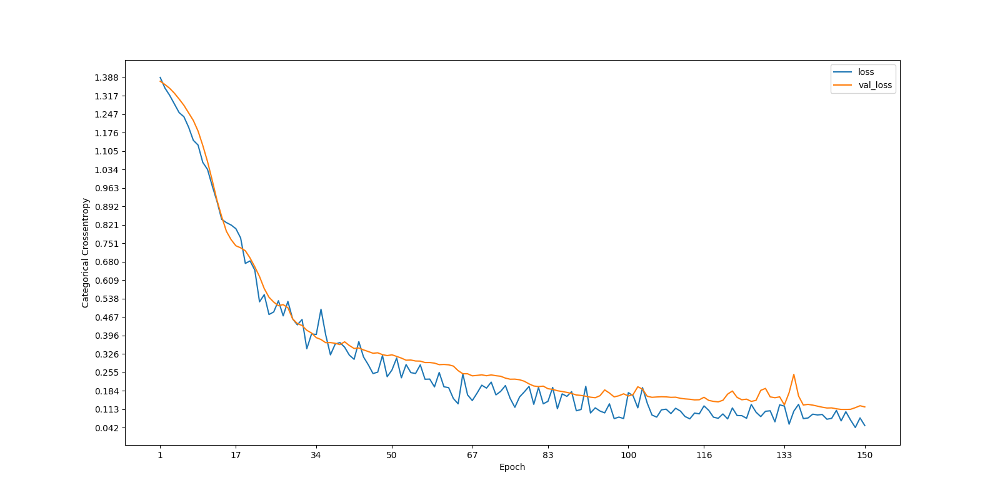
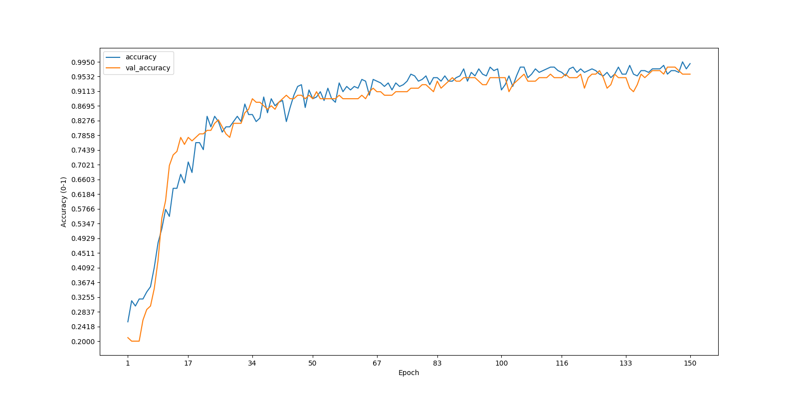

.. _howtouse:

How to Use
==========

Get start with BreakinGWs. In *breakingws/datamanage/data/* there are 400
images (circles, rectagles, lines and ellipses in low resolution and 
equallt distributed) that can be used to train your first CNN with 
supervised learning. If you you want more images to start with (e.g. 1000
per class), use *genimages.py* tool:

.. code-block:: bash

    $ genimages.py -n 1000
    
If an encouraging message rises up, your new data set has been modified.

Run your First CNN
------------------

In this example I'll show how to make classification of *data* images with the 
:ref:`imma <overview>` model. First of all decide how to split images in 
training, validation and test set. In this case, the validation is set to
the 25% of total images, sane for the test set, the rest is for the training set.
Go the the *breakingws/bin/* and write:

.. code-block:: bash

    $ runcnn.py -m imma -id data -vs 0.25
    
Now we can change some parameters of the model in order to optimize the
learning. The minimum number of filters used in a single convolutional layer 
and the *rate* parameter of the dropout layers can be set as follows:

.. code-block:: bash

    $ runcnn.py -m imma -id data -vs 0.25 -mf 4 -r 0.5 
    
Other important options are the batch size (number of samples that
will be propagated through the network) and the epochs before concluding 
the learning.

.. code-block:: bash

    $ runcnn.py -m imma -id data -vs 0.25 -mf 4 -r 0.5 -b 64 -e 150
    
At the end of the run, two graphs will be showed:

If the same *loss* and *accuracy* trend raises up (both training and validation),
it means that the CNN is doing a good job. The test results are saved in a 
*csv* file in *breakinges/cnn/results*.

Data Augmentation with Glitches Data
------------------------------------

