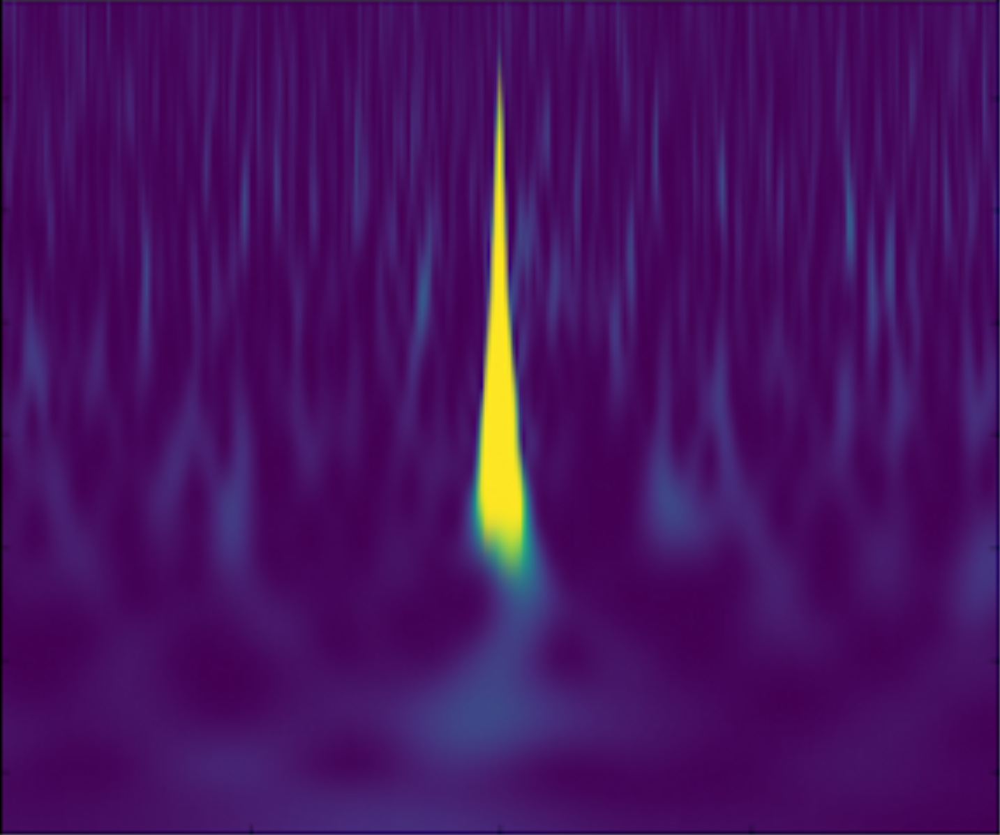

Welcome to BreakinGWs's documentation! 
======================================

BreakinGWs is a project for the *cmepda* course of the University of Pisa, voted to develop an efficient convolutuonal neural network for the study of the rapid noise artifacts (i.e. glitches) in gravitational waves detectors. This documentation shows the main modules of this package and a simple way of installing and have fun with it.

Indices and tables
------------------

* :ref:`genindex`
* :ref:`modindex`
* :ref:`search`

Contents 
--------

.. toctree::
   :maxdepth: 2

   modules
   installation
   howtouse
   breakingws
   
Gravity Spy Dataset
-------------------
   

In this project, I studied spectrograms of glitches provided by GravitySpy, 
encapsulating some classified data from the first observational run (O1)
of the two LIGO inferferometers, which in september 2015 observed the first 
gravitational signal ever detected.

